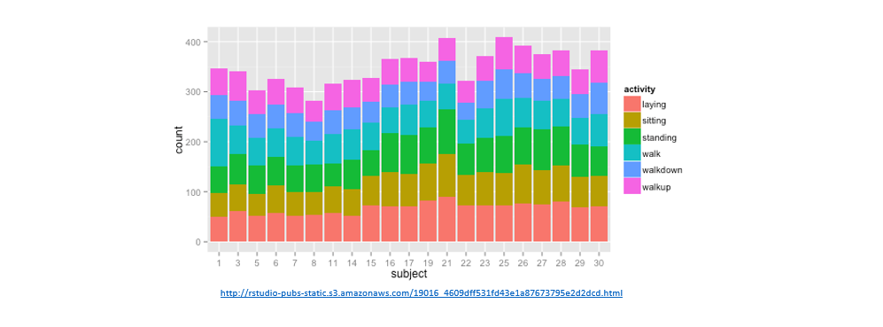
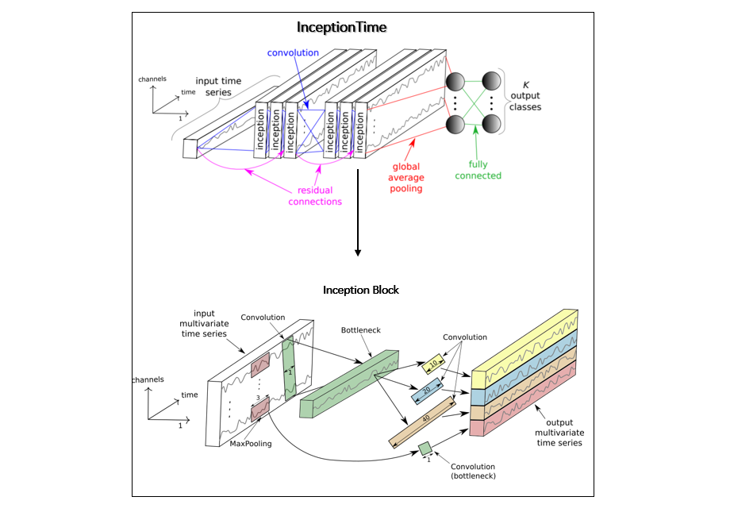
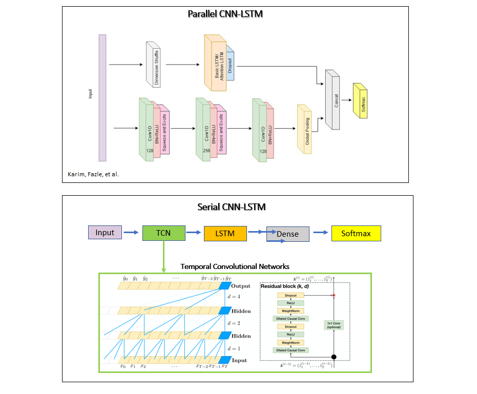

# Deep-TSC: Multivariate Time Series Classification

This repository shows the use of three distinct TSC algorithms on the [UCI-HAR dataset](https://archive.ics.uci.edu/ml/datasets/human+activity+recognition+using+smartphones). I've experimented with many different architectures and different means to interface CNNs with LSTMs. The working examples here should help you get started without a hassle and serve as good starting points.

## Dataset

- Data was collected using a cellphone attached to the waists of test subjects.  Each person performs 6 activities (walking, walking upstairs, walking downstairs, sitting, standing, laying) 
- Data consists of  3-axial linear acceleration and 3-axial angular velocity  collected at a constant rate of 50Hz using  the embedded accelerometer and gyroscope of the phone.
- To download and process training data from raw data , follow the instructions [here](https://machinelearningmastery.com/how-to-develop-rnn-models-for-human-activity-recognition-time-series-classification/). I've already done that and saved it as .npz file.

## Implementations
InceptionTime [2] uses 1D convolutions similar to CNNs used for image classification.

Parallel CNN-LSTM uses CNN layers and an attention LSTM layer in parallel [3]. This is in contrast to common serial CNN LSTM architectures, where CNNs are used to encode features and the LSTM layer is used to model long-term dependencies of the features across time. The authors in [3] use shuffle operation before the attention LSTM layer for computational efficiency. This enables global temporal information of each feature to be fed to the LSTM layer at once. Serial CNN LSTM uses temporal convolutional networks (TCN) as the CNN layers, which incorporate dilated causal convolutions to increase the receptive field of the CNN layers[4]. 

Networks that incorporate LSTM layers train substantially slower. Parallel LSTM CNN performs the best among the datasets I've experimented with and is a good starting point to tailor the architecture to your needs. 

> Note: Using class_weights changes the range of the loss. This may affect the stability of the training depending on the optimizer. Optimizers whose step size is dependent on the magnitude of the gradient, like optimizers.SGD, may fail. The optimizer used here, optimizers.Adam, is unaffected by the scaling change. Also note that because of the weighting, the total losses are not comparable between the two models.

## Files

**/models**

You can directly run the scripts below:
- Parallel_CNNLSTM_SA.py
- Serial_CNNLSTM_SA.py
- InceptionTime_SA.py

**/data**

- UCI_HAR.npz

   -data['features']: number of windows,samples per window, number of features
   
   -data['labels'] :  class label per window

## Dependencies

Tested on ubuntu 18.04
* conda 4.8.3
* keras 2.3.1
* tensorflow 1.14.0
* pydot 1.4.1

## References

Code references were cited in the scripts.

_[1]_  Anguita, Davide, et al. "A public domain dataset for human activity recognition using smartphones." Esann. 2013.

_[2]_ Fawaz, Hassan Ismail, et al. "InceptionTime: Finding AlexNet for Time Series Classification." arXiv preprint 
arXiv:1909.04939 (2019).

_[3]_ Karim, Fazle, et al. "Multivariate lstm-fcns for time series classification." Neural Networks 116 (2019): 237-245.

_[4]_ Oord, Aaron van den, et al. "Wavenet: A generative model for raw audio." arXiv preprint arXiv:1609.03499 (2016).
